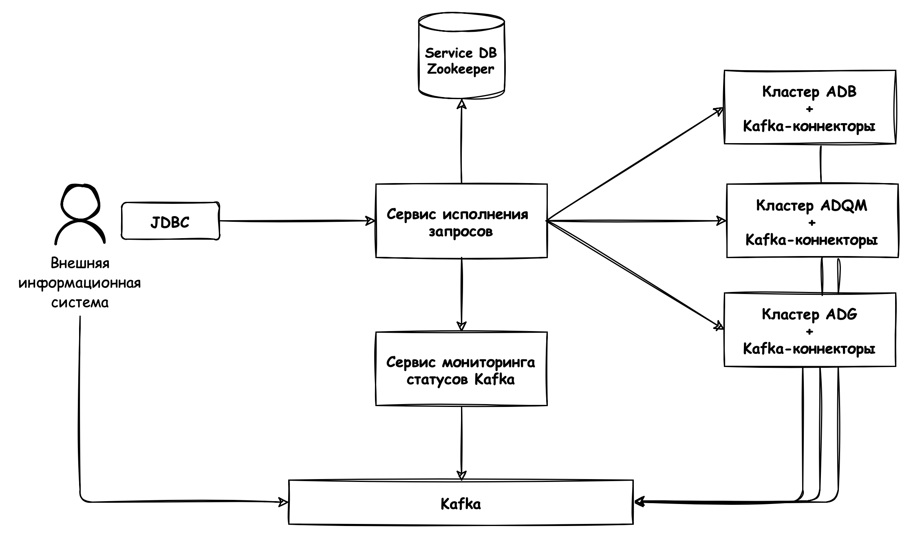
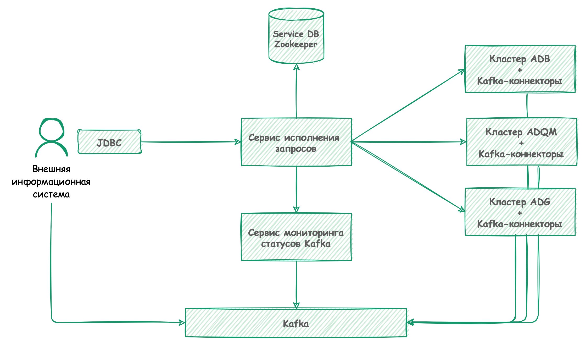
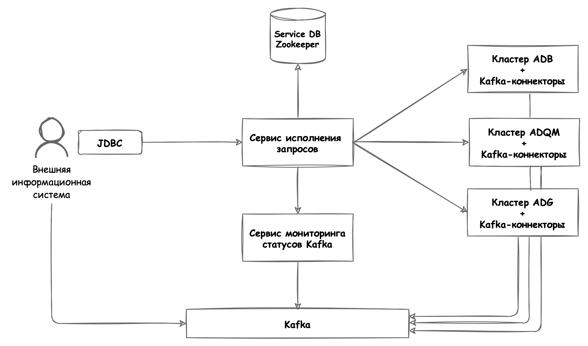

---
layout: default
title: Схемы развертывания
nav_order: 2
parent: Эксплуатация
has_children: false
has_toc: false
---

# Схемы развертывания {#deployment_diagrams}

Систему можно разворачивать различными способами, устанавливая различные наборы 
[связанных компонентов]((../../overview/interactions/interactions.md)), — в зависимости от целей проекта. 
Однако есть основные способы разворачивания системы:
* с кластерами каждой из следующих СУБД хранилища: ADB, ADQM и ADG;
* с сервером одной СУБД хранилища — ADP.

На рисунке ниже показана схема развертывания системы с ADB, ADQM и ADG.

<!--

{: .figure-center}
*Схема развертывания с ADB, ADQM и ADG*
{: .figure-caption-center}
-->

{: .figure-center}
*Схема развертывания с ADB, ADQM и ADG*
{: .figure-caption-center}

{: .figure-center}
*Схема развертывания с ADB, ADQM и ADG*
{: .figure-caption-center}

{: .figure-center}
*Схема развертывания с ADB, ADQM и ADG*
{: .figure-caption-center}