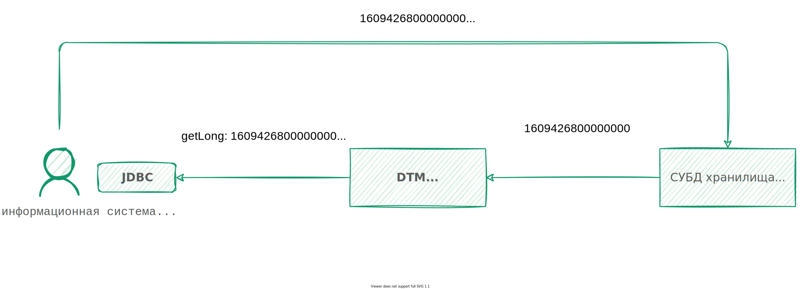

---
layout: default
title: Часовые пояса системы и компонентов
nav_order: 5
parent: Эксплуатация
has_children: false
has_toc: false
---

# Часовые пояса системы и компонентов {#time_zones}

* Значения времени должны лежать в диапазоне от 00:00:00.000000 до 23:59:59.999999 включительно.
* Все значения типа TIMESTAMP, загружаемые в систему и выгружаемые из нее, не содержат данных о часовых 
  поясах и рассматриваются системой как время UTC.
* Часовой пояс хранилища данных должен быть задан как UTC.
* JDBC-функции getDate, getTime и getTimestamp системы возвращают дату и время SQL без указания часового пояса 
  (значение java.sql.date, нормализованное относительно GMT+0).

{: .figure-center}
*Загружаемое и возвращаемое значения типа TIMESTAMP*
{: .figure-caption-center}