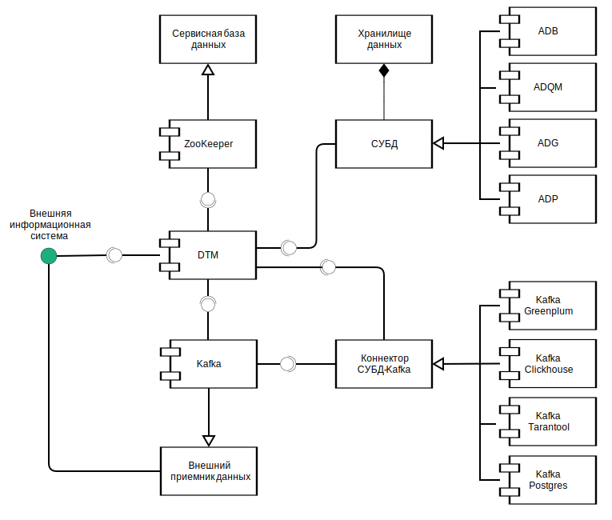

---
layout: default
title: Связи с другими системами и компонентами
nav_order: 3
parent: Обзор понятий, компонентов и связей
has_children: true
has_toc: false
---

# Связи с другими системами и компонентами {#interactions}

Система взаимодействует со следующими внешними системами и компонентами (см. рисунок [ниже](#img_interactions)):
*   внешней информационной системой-клиентом (по JDBC-интерфейсу),
*   [сервисной базой данных](../main_concepts/service_db/service_db.md) (по API ZooKeeper),
*   [СУБД](../../introduction/supported_DBMS/supported_DBMS.md) 
    [хранилища данных](../main_concepts/data_storage/data_storage.md) (по интерфейсу JDBC или 
    REST API — в зависимости от типа СУБД),
*   коннекторами (по API коннекторов);
*   брокером сообщений Kafka (по API Kafka).

На рисунке ниже показаны взаимодействия системы с внешними системами и компонентами. Состав внешних компонентов, 
с которыми работает система, может меняться в зависимости от требований проекта (см. раздел [Схемы развертывания](../../maintenance/deployment_diagrams/deployment_diagrams.md)).

{:height="70%" width="70%"}
{: .figure-center}
*Внешние взаимодействия системы*
{: .figure-caption-center}

Взаимодействия системы с внешними системами и компонентами при выполнении основных действий описаны 
в разделах:
*   [Порядок обработки запросов на обновление логической схемы](ddl_processing/ddl_processing.md),
*   [Порядок обработки запросов на загрузку данных](upload_processing/upload_processing.md),
*   [Порядок обработки запросов на выгрузку данных](download_processing/download_processing.md),
*   [Порядок обработки запросов на чтение данных](llr_processing/llr_processing.md).