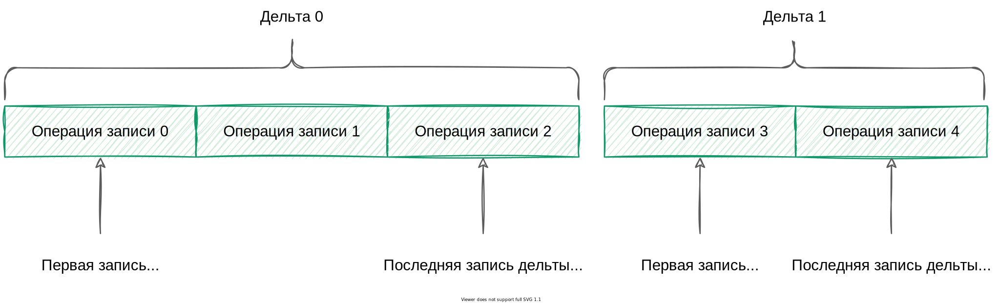
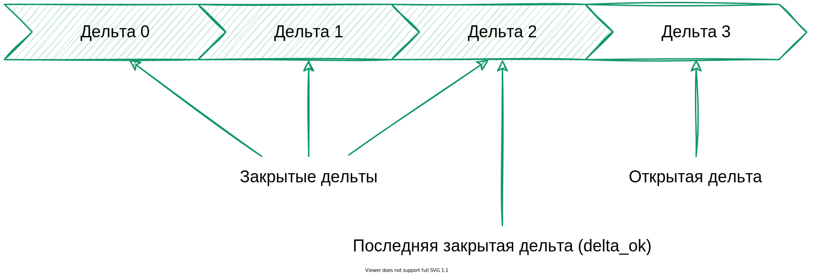

---
layout: default
title: Дельта
nav_order: 13
parent: Основные понятия
grand_parent: Обзор понятий, компонентов и связей
has_children: false
has_toc: false
---

# Дельта {#delta}

_Дельта_ — целостная совокупность изменений в [логической базе данных](../logical_db/logical_db.md). 
Дельта включает все [операции записи](../write_operation/write_operation.md), выполненные между открытием и 
закрытием этой дельты, и имеет порядковый номер, уникальный в рамках логической базы данных.

Нумерация дельт начинается с 0. Дельты упорядочены в порядке возрастания их номеров и формируют историю 
состояний данных логической БД.

На рисунке ниже показана последовательность операций записи, выполненных в рамках дельт с номерами 0 и 1. 
В рамках дельты 0 выполнены операции записи с номерами 0-2, в рамках дельты 1 — операции записи с номерами 3-6.

{: .figure-center}
*Операции записи двух дельт*
{: .figure-caption-center}

Дельту можно [открыть](../../../reference/sql_plus_requests/BEGIN_DELTA/BEGIN_DELTA.md), 
[закрыть](../../../reference/sql_plus_requests/COMMIT_DELTA/COMMIT_DELTA.md) и 
[отменить](../../../reference/sql_plus_requests/ROLLBACK_DELTA/ROLLBACK_DELTA.md) (откатить). 
Дельта, которая была открыта и еще не была закрыта, содержит горячие записи и называется открытой 
или горячей. Для каждой логической базы одновременно может быть открыто не более одной дельты. 
Дельта, которая была закрыта (зафиксирована) содержит актуальные записи и называется закрытой.

На рисунке ниже показана последовательность дельт, где дельта с номером 3 является открытой, а все 
предыдущие — закрытыми.

{: .figure-center}
*Открытая и закрытые дельты*
{: .figure-caption-center}

Для [загрузки данных](../../../working_with_system/data_upload/data_upload.md) в логическую БД нужно открыть 
дельту, загрузить данные в требуемые логические таблицы, после чего сохранить изменения (закрыть дельту). 
В рамках открытой дельты можно выполнить любое число операций записи.

Не допускается загрузка различных состояний объекта в одной дельте. Для загрузки нового состояния объекта 
нужно закрыть дельту, открыть новую дельту и загрузить необходимые изменения 
(см. рисунок [ниже](#img_data_update)).
{: .note-wrapper}

На рисунке ниже показан пример обновления данных клиента, сменившего фамилию. Первоначальные данные 
клиента загружены в рамках дельты 0, а обновленные данные — в рамках дельты 1.

{: .figure-center}
*Обновление данных клиента, сменившего фамилию*
{: .figure-caption-center}

Если нужно вернуть состояние данных, которое предшествовало изменениям, выполненным в рамках открытой 
дельты, следует [откатить дельту](../../../reference/sql_plus_requests/ROLLBACK_DELTA/ROLLBACK_DELTA.md).
Откатить можно только открытую дельту, после закрытия дельты возврат к предыдущему состоянию данных невозможен.

При запросе и выгрузке данных номер дельты можно использовать, чтобы указать момент или период, 
по состоянию на который запрашивается информация (см. секцию [FOR SYSTEM_TIME](../../../reference/sql_plus_requests/SELECT/SELECT.md#for_system_time) 
в разделе [SELECT](../../../reference/sql_plus_requests/SELECT/SELECT.md)).