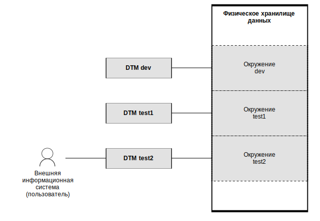

---
layout: default
title: Окружение
nav_order: 3
parent: Основные понятия
grand_parent: Обзор понятий, компонентов и связей
has_children: false
has_toc: false
---

# Окружение {#environment}

_Окружение_ — совокупность [логических баз данных](../logical_db/logical_db.md), 
доступных при работе с системой. Инсталляция системы работает с окружением, заданным в 
[конфигурации системы](../../../maintenance/configuration/system/system.md).

Допустимо создавать несколько окружений для одного набора кластеров СУБД и при необходимости перенастраивать
инсталляцию системы на другое окружение. Попеременное использование независимых окружений может быть полезно,
например, в случае разделения различных тестовых сред.

На рисунке ниже показан пример инсталляции системы с тремя окружениями, где в настоящий момент внешняя информационная
система работает с окружением test2.

{:height="90%" width="90%"}
{: .figure-center}
*Инсталляция системы с тремя окружениями*
{: .figure-caption-center}