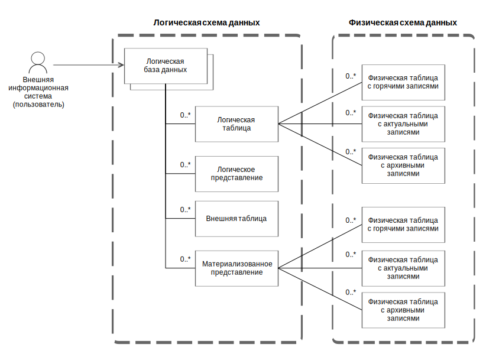

---
layout: default
title: Логическая схема данных
nav_order: 1
parent: Основные понятия
grand_parent: Обзор понятий, компонентов и связей
has_children: false
has_toc: false
---

# Логическая схема данных {#logical_schema}

_Логическая схема данных_ — внешнее представление структуры данных [окружения](../environment/environment.md), 
единое для всех [поддерживаемых СУБД](../../../introduction/supported_DBMS/supported_DBMS.md) 
[хранилища](../data_storage/data_storage.md). Логическая схема данных представляет собой иерархию 
следующих объектов:
*   [логических баз данных](../logical_db/logical_db.md),
*   [логических таблиц](../logical_table/logical_table.md),
*   [логических представлений](../logical_view/logical_view.md),
*   [материализованных представлений](../materialized_view/materialized_view.md),
*   [внешних таблиц](../external_table/external_table.md).

Логическая схема данных хранится в [сервисной базе данных](../service_db/service_db.md) системы.

На рисунке ниже показана иерархия объектов логической схемы данных.

{: .figure-center}
*Объекты логической схемы и их связи с объектами физической схемы*
{: .figure-caption-center}

Внешняя информационная система (пользователь) отправляет системе запросы к данным, сформулированные в терминах 
логической схемы. Система разбирает полученные запросы, модифицирует (обогащает) их нужным образом и перенаправляет 
к [физическим таблицам](../physical_table/physical_table.md) хранилища данных. 
В зависимости от момента времени, указанного в запросе, система обращается к горячим, актуальным или архивным данным. 
Такая модель взаимодействия позволяет работать с различными версиями данных, которые хранятся в различных СУБД 
хранилища, в едином формате.

**Связанные разделы:**
*   [Управление схемой данных](../../../working_with_system/logical_schema_update/logical_schema_update.md).