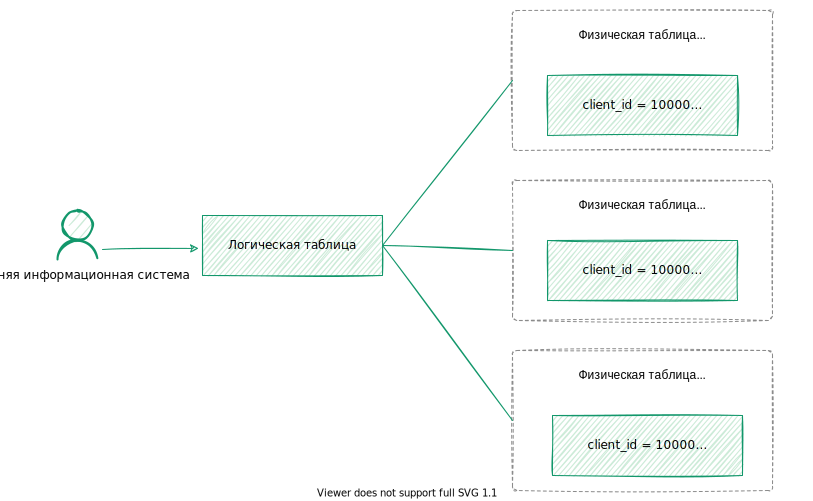

---
layout: default
title: Логическая таблица
nav_order: 4
parent: Основные понятия
grand_parent: Обзор понятий, компонентов и связей
has_children: false
has_toc: false
---

# Логическая таблица {#logical_table}

_Логическая таблица_ — структурированная совокупность записей о состояниях объектов одного типа, 
например счетов или контрагентов. Логическая таблица не хранит сами данные, а предоставляет 
доступ к данным соответствующих [физических таблиц](../physical_table/physical_table.md) 
[хранилища](../data_storage/data_storage.md).

В отличие от реляционной таблицы, объекты которой обычно хранятся в актуальном (текущем) 
состоянии, логическая таблица предоставляет информацию обо всех исторических состояниях объектов: 
новых, актуальных и архивных. Например, данные одного клиента могут иметь нескольких версий 
в логической таблице `clients`:
*   архивная запись с номером телефона `+7(342)205-90-59` и адресом `Пермь`,
*   актуальная запись с номером телефона `+7(495)777-77-77` и адресом `Пермь` 
    (клиент сменил номер телефона),
*   горячая (новая) запись с номером телефона `+7(495)777-77-77` и адресом `Москва` 
    (клиент сменил адрес; запись загружена, но еще не зафиксирована).

На рисунке ниже показана схема связей логической таблицы с ее физическими представлениями 
— физическими таблицами хранилища данных.

{:height="80%" width="80%"}
{: .figure-center}
*Связи логической таблицы с физическими таблицами*
{: .figure-caption-center}

Работа с логическими таблицами напоминает работу с реляционными таблицами. Логические 
таблицы можно [создавать](../../../working_with_system/logical_schema_update/create_table/create_table.md) 
и [удалять](../../../working_with_system/logical_schema_update/drop_table/drop_table.md). 
Данные логической таблицы можно [загружать](../../../working_with_system/data_upload/data_upload.md), 
[обновлять](../../../working_with_system/data_update/data_update.md),
[запрашивать](../../../working_with_system/data_reading/data_reading.md) и 
[выгружать](../../../working_with_system/data_download/data_download.md).

При обращении к данным логической таблицы можно указать 
[момент времени](../../../reference/sql_plus_requests/SELECT/SELECT.md#for_system_time), по состоянию на который запрашиваются данные. Если момент 
времени не указан, система возвращает данные, актуальные на момент обработки запроса. 
Таким образом, можно получать данные из логической таблицы по состоянию на любой момент 
времени — независимо от того, являются они горячими (новыми), актуальными или архивными.

При создании логической таблицы система автоматически создает и далее поддерживает
[набор физических таблиц](../physical_schema/physical_schema.md) 
для хранения данных.