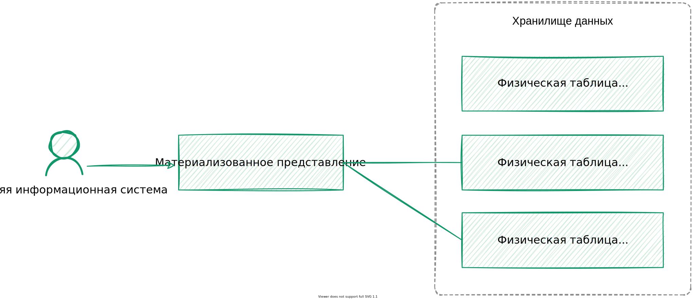
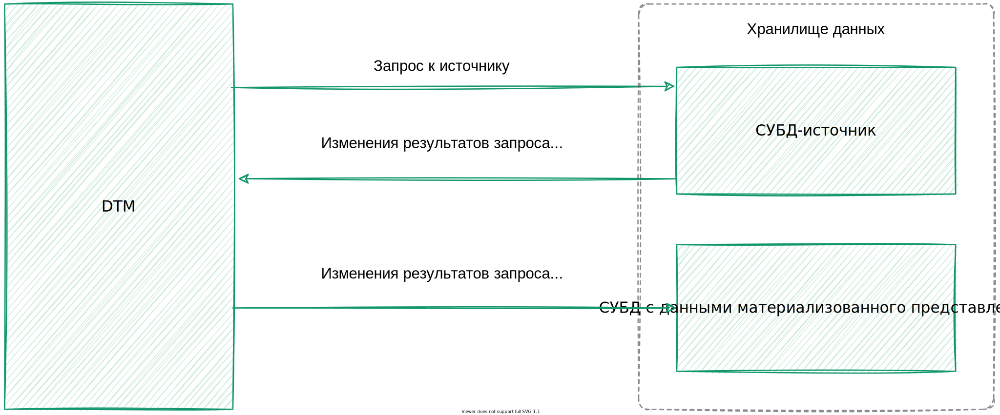

---
layout: default
title: Материализованное представление
nav_order: 6
parent: Основные понятия
grand_parent: Обзор понятий, компонентов и связей
has_children: false
has_toc: false
---

# Материализованное представление {#materialized_view}
{: .no_toc }

<details markdown="block">
  <summary>
    Содержание раздела
  </summary>
  {: .text-delta }
1. TOC
{:toc}
</details>

_Материализованное представление_ — структурированная совокупность записей, содержащих результаты запроса к данным 
одной или нескольких [логических таблиц](../logical_table/logical_table.md). Материализованное 
представление позволяет предварительно вычислить результат запроса и сохранить его для будущего использования.

Материализованное представление строится на основе данных одной [СУБД](../../../introduction/supported_DBMS/supported_DBMS.md) 
[хранилища](../data_storage/data_storage.md) (далее — СУБД-источник), а его данные размещаются в другой СУБД. 
Это позволяет создавать инсталляции, где одна СУБД служит полноценным хранилищем исходных данных, а остальные СУБД 
отвечают за быструю выдачу данных по запросам чтения. В текущей версии системы доступно создание материализованных 
представлений в ADG на основе данных из ADB.

Материализованное представление помогает ускорить запросы к данным в следующих случаях:
* если представление содержит результаты сложного запроса, который на исходных данных выполняется дольше; 
* если запросы к представлению возвращают значительно меньше данных, чем запросы к исходным данным;
* если запросы относятся к категории, которую СУБД хранилища, где размещены данные представления, выполняет более 
  эффективно, чем СУБД-источник (например, ADG быстрее всех из [поддерживаемых СУБД](../../../introduction/supported_DBMS/supported_DBMS.md)
  обрабатывает чтение по ключу).
  
Материализованное представление дает доступ к актуальным и архивным состояниях объектов. Чтение горячих 
данных из представления недоступно: это позволяет избежать чтения изменений, загруженных из СУБД-источника 
только частично. 
Данные материализованного представления хранятся аналогично данным логических таблиц — в [физических таблицах](../physical_table/physical_table.md) 
[хранилища](../data_storage/data_storage.md), которые автоматически создаются при создании представления.

{:height="90%" width="90%"}
{: .figure-center}
*Связи материализованного представления с физическими таблицами*
{: .figure-caption-center}

Система поддерживает целостность данных материализованных представлений, периодически синхронизируя их с
данными СУБД-источника (см. [ниже](#synchronization)).

{:height="90%" width="90%"}
{: .figure-center}
*Синхронизация материализованного представления*
{: .figure-caption-center}

Материализованные представления можно [создавать](../../../working_with_system/logical_schema_update/create_materialized_view/create_materialized_view.md) 
и [удалять](../../../working_with_system/logical_schema_update/drop_materialized_view/drop_materialized_view.md).
Из материализованного представления можно [запрашивать](../../../working_with_system/data_reading/data_reading.md) 
и [выгружать](../../../working_with_system/data_download/data_download.md) данные — так же, как из логических таблиц и 
[логических представлений](../logical_view/logical_view.md). 
[Загрузка](../../../working_with_system/data_upload/data_upload.md) и 
[обновление](../../../working_with_system/data_update/data_update.md) данных недоступны для 
материализованных представлений.

При запросе или выгрузке данных из материализованного представления можно указать [момент времени](../../../reference/sql_plus_requests/SELECT/SELECT.md#for_system_time), 
по состоянию на который запрашиваются данные. Если момент времени не указан, система возвращает (выгружает) данные, актуальные
на момент последней синхронизации представления, иначе — данные, актуальные на запрашиваемый момент времени. 

При запросе или выгрузке данных на указанный момент времени может оказаться, что материализованное представление отстало от 
СУБД-источника и не содержит запрошенные данные. В этом случае система перенаправляет запрос к исходным таблицам СУБД-источника
(см. раздел [Маршрутизация запросов к данным материализованных представлений](../../../working_with_system/data_reading/routing/routing.md#mat_view_routing)).
Перенаправленный запрос может выполняться дольше, однако это позволяет получить данные, полностью актуальные 
на указанный момент времени.

## Синхронизация материализованных представлений {#synchronization}

Система периодически проверяет, нужно ли синхронизировать материализованные представления [окружения](../environment/environment.md) 
с СУБД-источником. Периодичность проверки настраивается в [конфигурации](../../../maintenance/configuration/configuration.md) 
системы (см. параметр `MATERIALIZED_VIEWS_SYNC_PERIOD_MS`); по умолчанию проверка запускается раз в 5 секунд.

Проверка материализованных представлений запускается только по таймеру и не запускается по другим событиям, таким 
как создание материализованного представления или загрузка данных в СУБД-источник. При срабатывании таймера система 
проверяет, появились ли в СУБД-источнике [дельты](../delta/delta.md), закрытые после последней синхронизации и, 
если такие дельты появились, система синхронизирует материализованные представления с СУБД-источником. 

Количество одновременно синхронизируемых представлений задается в конфигурации с помощью параметра 
`MATERIALIZED_VIEWS_CONCURRENT`. По умолчанию одновременно синхронизируется максимум два представления, а остальные, 
если они есть, ожидают следующего цикла проверки.

Данные представления синхронизируются отдельно по каждой закрытой дельте — с полным сохранением изменений, 
выполненных в этих дельтах. В каждой дельте для материализованного представления рассчитывается и сохраняется 
результат запроса, указанного при создании этого представления. Таким образом, материализованное представление 
имеет такой же уровень историчности данных, как и исходные логические таблицы, на которых построено представление.

Если системе не удалось синхронизировать материализованное представление, она делает несколько повторных попыток. 
Максимальное количество попыток синхронизации представления задается в конфигурации (см. параметр `MATERIALIZED_VIEWS_RETRY_COUNT`), 
по умолчанию система делает до 10 попыток. Если количество попыток исчерпано, но материализованное представление так и 
не удалось синхронизировать, система прекращает попытки синхронизировать это представление (до перезапуска). 
После перезапуска системы счетчики попыток по всем представлениям обнуляются, и, если какие-либо представления 
остались несинхронизированными, система возобновляет попытки их синхронизировать.

### Пример синхронизации материализованного представления {#synchronization_example}

Рассмотрим пример со следующими условиями:
* логическая БД `sales` содержит логическую таблицу `sales` и материализованное представление `sales_by_stores`;
* логическая БД содержит две дельты:
  * дельта 0: в таблицу `sales` загружено две записи (с идентификаторами 100 и 101);
  * дельта 1: в таблицу `sales` загружено еще две записи (с идентификаторами 102 и 103);
* материализованное представление `sales_by_stores` содержит результат агрегации и группировки данных таблицы `sales` и 
построено на основе следующего запроса:
```sql
CREATE MATERIALIZED VIEW sales.sales_by_stores (
store_id INT NOT NULL,
product_code VARCHAR(256) NOT NULL,
product_units INT NOT NULL,
PRIMARY KEY (store_id, product_code)
)
DISTRIBUTED BY (store_id)
DATASOURCE_TYPE (adg)
AS SELECT store_id, product_code, SUM(product_units) as quantity FROM sales.sales
   WHERE product_code <> 'ABC0001'
   GROUP BY store_id, product_code
DATASOURCE_TYPE = 'adb'
```

На рисунках ниже показан порядок синхронизации материализованного представления `sales_by_stores`. В каждой дельте
рассчитывается и сохраняется сумма по столбцу `product_units` таблицы `sales` с группировкой по столбцам `store_id` и 
`product_code`. При этом неважно, когда было создано материализованное представление: до дельты 0, после дельты 1 или 
в какой-то момент между этими дельтами.


{: .figure-center}
*Состояние данных на момент дельты 0*
{: .figure-caption-center}


{: .figure-center}
*Состояние данных на момент дельты 1*
{: .figure-caption-center}