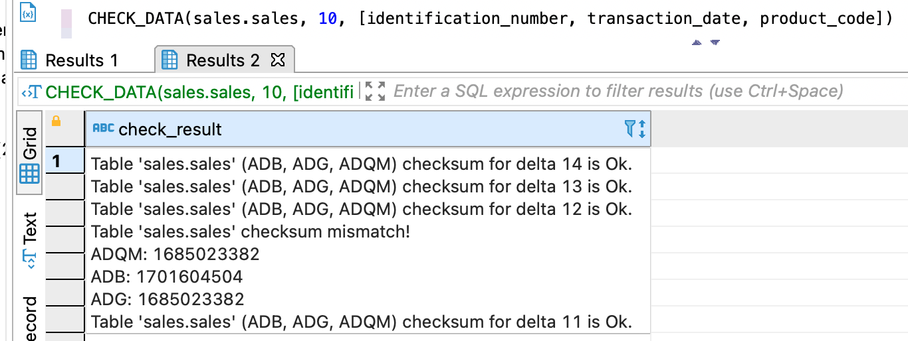

---
layout: default
title: CHECK_DATA
nav_order: 3
parent: Запросы SQL+
grand_parent: Справочная информация
has_children: false
has_toc: false
---

# CHECK_DATA
{: .no_toc }

<details markdown="block">
  <summary>
    Содержание раздела
  </summary>
  {: .text-delta }
1. TOC
{:toc}
</details>

Запрос позволяет проверить идентичность данных [логической таблицы](../../../overview/main_concepts/logical_table/logical_table.md), 
загруженных за определенный период во все [СУБД](../../../introduction/supported_DBMS/supported_DBMS.md) 
[хранилища](../../../overview/main_concepts/data_storage/data_storage.md). Идентичность проверяется по всем [операциям записи](../../../overview/main_concepts/write_operation/write_operation.md)
таблицы, начиная с [дельты](../../../overview/main_concepts/delta/delta.md), 
указанной в запросе, и заканчивая последней закрытой дельтой. Обе граничные дельты включаются в проверку.

Алгоритм проверки зависит от параметров запроса:
*   если столбцы указаны, по каждой операции записи в каждой из целевых СУБД рассчитывается 
    контрольная сумма на основе значений этих столбцов и полученные суммы сравниваются между СУБД;
*   если столбцы не указаны, по каждой операции записи в каждой из целевых СУБД рассчитывается количество
    записей и полученные значения сравниваются между СУБД.

Подробнее о порядке проверки данных см. в секции [Порядок проверки данных](#порядок-проверки-данных). 
Примеры запросов и ответов см. в секции [Примеры](#примеры).
    
**Примечание:** в проверке участвуют целевые СУБД хранилища — те СУБД, в которых размещены данные 
проверяемой логической таблицы. Если такая СУБД одна, проверка все равно проходит и считается успешной 
(см. рисунок [ниже](#img_check_for_one_db)).

В ответе возвращается:
*   объект ResultSet с одной записью, содержащей результаты проверки, при успешном выполнении запроса;
*   исключение при неуспешном выполнении запроса.

Если запрос выполнен успешно, ответ содержит сообщение об успешной проверке или найденных расхождениях, 
а также список проверенных СУБД хранилища.

## Синтаксис

```sql
CHECK_DATA([db_name.]table_name, delta_number[, square-bracketed_column_list])
```

## Параметры

*   `db_name` — имя логической базы данных, в которой находится проверяемая логическая таблица. Параметр 
    опционален, если выбрана логическая БД, [используемая по умолчанию](../../../working_with_system/other_features/default_db_set-up/default_db_set-up.md);
*   `table_name` — имя проверяемой логической таблицы;
*   `delta_number` — номер дельты, с которой начинается проверка. Должен быть меньше или равен номеру 
    последней закрытой дельты. Номер последней закрытой дельты можно узнать с помощью запроса 
    [GET_DELTA_OK](../../../reference/sql_plus_requests/GET_DELTA_OK/GET_DELTA_OK.md);
*   `square_bracketed_column_list` — список проверяемых столбцов таблицы. Элементы списка должны быть 
    указаны в квадратных скобках через запятую, например `[identification_number, transaction_date]`. 
    Если столбцы указаны, проверяется контрольная сумма записей по каждой операции записи во всех целевых 
    СУБД хранилища, иначе — количество таких записей.
    
## Ограничения

*   Разные наборы данных могут иметь одинаковую контрольную сумму, поэтому возможен ложноположительный результат проверки.
*   Количество записей в проверяемых операциях записи не должно превышать `4'294'967'298`, иначе 
    выдается исключение.

## Примеры

### Запрос без перечисления столбцов

Проверка целостности данных логической таблицы `stores75` в диапазоне \[дельта 0, последняя закрытая дельта\]:
```sql
CHECK_DATA(sales.stores75, 0)
```

На рисунке ниже показан пример ответа `CHECK_DATA` при успешной проверке логической таблицы `stores75`, 
данные которой размещены только в ADB.

<a id="img_check_for_one_db"></a>
{:height="50%" width="50%"}
{: .figure-center}
*Ответ CHECK_DATA с проверкой только в ADB*
{: .figure-caption-center}

### Запрос с перечислением столбцов

Проверка целостности данных столбцов `identification_number` и `transaction_date` таблицы `sales`:
```sql
CHECK_DATA(sales.sales, 4, [identification_number, transaction_date])
```

На рисунке ниже показан пример ответа на запрос `CHECK_DATA` по столбцам таблицы при наличии расхождений: 
контрольная сумма в ADB отличается от контрольной суммы в ADG и ADQM.


{: .figure-center}
*Ответ CHECK_DATA с найденными расхождениями*
{: .figure-caption-center}

## Порядок проверки данных

Идентичность данных проверяется в следующем порядке:
1. В каждой из целевых СУБД:
    1. Выбираются проверяемые дельты: от указанной в запросе до последней закрытой (обе включительно).
    2. По каждой дельте выбираются все операции записи, совершенные в логической таблице, которая указана
       в запросе.
    3. По каждой операции записи — в зависимости от параметров запроса — рассчитывается количество или 
       контрольная сумма загруженных записей. Алгоритм расчета контрольной суммы см. [ниже](#алгоритм-расчета-контрольной-суммы).
2. Значения по каждой операции записи сравниваются в целевых СУБД.
3. Если запрос обработан успешно, но хотя бы одно из значений отсутствует или не соответствует другим, 
   в ответе возвращается сообщение о расхождениях в данных. Иначе возвращается сообщение об успешной проверке.

<a id="sect_sys_cn_checksum"></a>
## Алгоритм расчета контрольной суммы

Контрольная сумма по операции записи рассчитывается по следующему алгоритму:
1. По каждой записи, загруженной в логическую таблицу в операции записи, формируется текстовая строка: 
   значения столбцов конвертируются в зависимости от типа данных (см. таблицу [ниже](#tab_date_type_conversion)) 
   и записываются через точку с запятой. Значение NULL записывается как пустая строка.
2. Для полученной строки вычисляется MD5-хеш в виде байтовой последовательности в шестнадцатеричном формате.
3. Хеш интерпретируется как ASCII-строка в нижнем регистре.
4. Из строки выбираются первые 4 символа строки, выстраиваются в порядке от младшего к старшему 
   (little endian) и конвертируются в целочисленную 32-битную контрольную сумму записи.
5. Контрольные суммы всех записей, загруженных в одной операции записи, суммируются — получается 64-битная 
   контрольная сумма операции записи.

В таблице ниже показано, как значения столбцов (`column_value`), указанных в запросе, конвертируются 
в зависимости от их типа данных.
<a id="tab_date_type_conversion"></a>

| Тип данных | Порядок конвертации | Пример
|:-|:-|:-
| BOOLEAN | (column_value)::int | true -> 1
| DATE | column_value - make_date(1970, 01, 01) | 2021-03-15 -> 18701
| TIME | (extract(epoch from column_value)*1000000)::bigint | 13:01:44 -> 46904000000
| TIMESTAMP | (extract(epoch from column_value)*1000000)::bigint  | 2020-11-17 21:11:12 -> 1605647472000000
| Другие типы данных | column_value | Иванов -> Иванов

<a id="sect_check_data_example"></a>
### Пример расчета контрольной суммы

Рассмотрим пример расчета контрольной суммы для одной записи таблицы `sales` со следующими значениями:
* `identification_number` = 10021, 
* `transaction_date` = 2020-11-17 21:11:12, 
* `product_code` = ABC1830.

Контрольная сумма рассчитывается в следующем порядке:
1. Формируется строка для хеш-функции: `10021;1605647472000000;ABC1830`.
2. Вычисляется MD5-хеш: `bedbead6aea8ca373d8f0a15713639c1`.
3. Выбираются первые 4 символа хеша: `bedb`.
4. Символы интерпретируются как ASCII-строка в нижнем регистре: `98 101 100 98`.
5. Строка конвертируется в целое 32-битное число: 98\*2<sup>0</sup> + 101\*2<sup>8</sup> + 100\*2<sup>16</sup> + 
   98\*2<sup>24</sup> = 1650746722.

Контрольная сумма записи по рассмотренным столбцам равна `1650746722`.