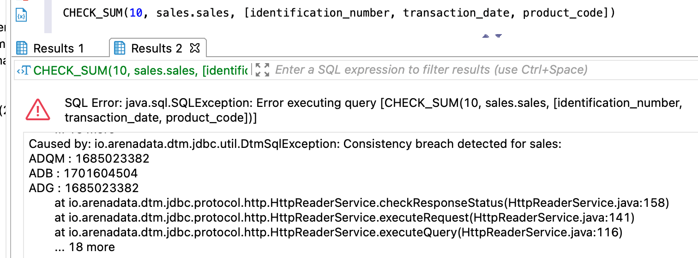

---
layout: default
title: CHECK_SUM
nav_order: 5
parent: Запросы SQL+
grand_parent: Справочная информация
has_children: false
has_toc: false
---

# CHECK_SUM

Запрос позволяет рассчитать контрольную сумму данных в указанной [дельте](../../../overview/main_concepts/delta/delta.md).
Дельта может быть любой: как закрытой, так и открытой (горячей).

Расчет контрольной суммы возможен по следующим данным:
*   отдельным столбцам [логической таблицы](../../../overview/main_concepts/logical_table/logical_table.md),
*   всем столбцам логической таблицы,
*   всем логическим таблицам [логической базы данных](../../../overview/main_concepts/logical_db/logical_db.md).

Контрольная сумма рассчитывается для каждой целевой СУБД [хранилища](../../../overview/main_concepts/data_storage/data_storage.md). 
Под целевыми СУБД подразумеваются СУБД, в которых размещены данные проверяемой логической таблицы 
или логической базы данных.

Контрольная сумма рассчитывается пошагово: по логической таблице и затем, если требуется,
по всей логической базе данных. Полученные значения сравниваются между целевыми СУБД. Если 
контрольные суммы на каком-либо из шагов не совпадают в разных СУБД, в ответе возвращается исключение 
`Consistency breach detected for <entity_name>`.
Подробнее об алгоритмах расчета контрольных сумм см. [ниже](#алгоритмы-расчета-контрольных-сумм).

В ответе возвращается:
*   объект ResultSet с одной записью, содержащей контрольную сумму данных, при успешном выполнении запроса 
    и отсутствии расхождений между СУБД хранилища;
*   исключение при наличии расхождений или неуспешном выполнении запроса.

Примеры запросов и ответов см. в секции [Примеры](#примеры).

## Синтаксис

```sql
CHECK_SUM(delta_num[, [db_name.]table_name[, square-bracketed_column_list]])
```

## Параметры

*   `delta_num` — номер открытой (горячей) или закрытой [дельты](../../../overview/main_concepts/delta/delta.md), 
    по которой рассчитывается контрольная сумма. Если других аргументов в запросе нет, контрольная сумма 
    рассчитывается по всей логической БД;
*   `table_name` (опциональный) — имя логической таблицы, по которой рассчитывается 
    контрольная сумма;
*   `square-bracketed_column_list` (опциональный) — список имен столбцов указанной логической таблицы, 
    по которым рассчитывается контрольная сумма. Элементы списка перечисляются внутри квадратных 
    скобок через запятую. Если список столбцов не указан, контрольная сумма рассчитывается по всем столбцам 
    логической таблицы.
    
## Ограничения

*   Разные наборы данных могут иметь одинаковую контрольную сумму.
*   Количество записей в проверяемых операциях записи не должно превышать `4'294'967'298`, иначе 
    выдается исключение.

## Примеры

### Запрос по столбцам логической таблицы

Расчет контрольной суммы по трем столбцам таблицы `sales` в десятой дельте:
```sql
CHECK_SUM(10,sales.sales,[identification_number, transaction_date, product_code])
```

На рисунках ниже показаны примеры ответов на запрос `CHECK_SUM` с перечислением столбцов: 
на первом — ответ при отсутствии расхождений в данных между СУБД хранилища, на втором — ответ при 
наличии расхождений.


{: .figure-center}
*Ответ CHECK_SUM по указанным столбцам таблицы при отсутствии расхождений*
{: .figure-caption-center}


{: .figure-center}
*Ответ CHECK_SUM при наличии расхождений*
{: .figure-caption-center}

### Запрос по логической таблице (всем столбцам таблицы)

Расчет контрольной суммы по всей таблице `sales` в десятой дельте:
```sql
CHECK_SUM(10,sales.sales)
```

На рисунке ниже показан пример ответа на запрос `CHECK_SUM` по логической таблице.

{:height="40%" width="40%"}
{: .figure-center}
*Ответ CHECK_SUM по логической таблице*
{: .figure-caption-center}

### Запрос по логической базе данных

Расчет контрольной суммы по всей логической базе данных `sales` в десятой дельте:
```sql
USE sales
CHECK_SUM(10)
```

На рисунке ниже показан пример ответа на запрос `CHECK_SUM` по логической базе данных.

{:height="40%" width="40%"}
{: .figure-center}
*Ответ CHECK_SUM по логической базе данных*
{: .figure-caption-center}

## Алгоритмы расчета контрольных сумм

### Расчет контрольной суммы по логической таблице

Контрольная сумма по логической таблице рассчитывается по следующему алгоритму:
1. По каждой операции записи таблицы в указанной дельте рассчитывается контрольная сумма. 
Алгоритм расчета такой же, как [описанный в разделе CHECK_DATA](../CHECK_DATA/CHECK_DATA.md#sect_sys_cn_checksum).
2. Контрольные суммы всех операций записи таблицы выстраиваются в порядке от самой последней к первой и 
   записываются через точку с запятой.
3. Для полученной строки вычисляется MD5-хеш в виде байтовой последовательности в шестнадцатеричном формате.
4. Хеш интерпретируется как ASCII-строка в нижнем регистре.
5. Из строки выбираются первые 8 символов строки, выстраиваются в порядке от младшего к старшему (little endian) 
и конвертируются в целочисленную 64-битную контрольную сумму.

### Расчет контрольной суммы по логической базе данных

Контрольная сумма по логической базе данных рассчитывается по следующему алгоритму:
1. Таблицы логической БД выстраиваются в алфавитном порядке. 
2. По каждой таблице логической БД в указанной дельте рассчитывается контрольная сумма, 
   как описано [выше](#расчет-контрольной-суммы-по-логической-таблице).
3. Контрольные суммы по таблицам записываются через точку с запятой. 
4. Далее порядок расчета такой же, как для таблицы (см. пункты 3-5 [выше](#расчет-контрольной-суммы-по-логической-таблице)).

### Пример расчета контрольной суммы по таблице

Рассмотрим пример расчета контрольной суммы по таблице `sales` в дельте, содержащей две 
операции записи. Для простоты примера по каждой из записей возьмем заранее рассчитанную 32-битную контрольную 
сумму: 1650746722 (см. [пример расчета](../CHECK_DATA/CHECK_DATA.md#sect_check_data_example) 
в разделе [CHECK_DATA](../CHECK_DATA/CHECK_DATA.md)) и 808792881.

Контрольная сумма рассчитывается в следующем порядке:
1. Формируется строка для хеш-функции: `808792881;1650746722`.
2. Вычисляется MD5-хеш: `ee0a6e094e2badb9d7dc5c9d7bebb961`.
3. Выбираются первые 8 символов хеша: `92832a11`.
4. Символы интерпретируются как ASCII-строка в нижнем регистре: `57 50 56 51 50 97 49 49`.
5. Строка конвертируется в целое 32-битное число: 
   57\*2<sup>0</sup> + 50\*2<sup>8</sup> + 56\*2<sup>16</sup> + 51\*2<sup>24</sup> + 50\*2<sup>32</sup>
   97\*2<sup>40</sup> + 49\*2<sup>48</sup> + 49\*2<sup>56</sup> = 3544721249952870969.

Контрольная сумма записи по рассмотренной таблице равна `3544721249952870969`.