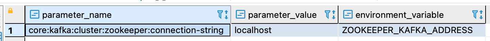
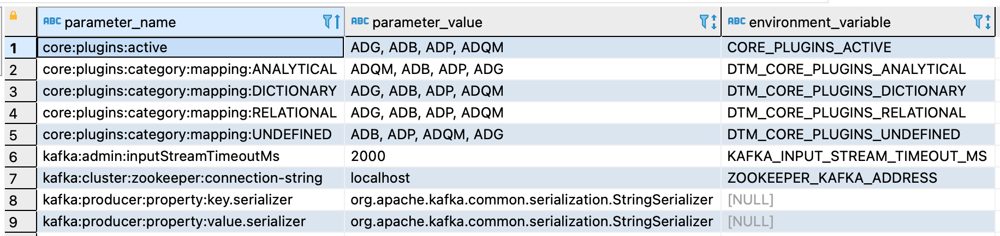

---
layout: default
title: CONFIG_SHOW
nav_order: 9
parent: Запросы SQL+
grand_parent: Справочная информация
has_children: false
has_toc: false
---

# CONFIG_SHOW

Запрос позволяет получить информацию об одном или всех параметрах 
[конфигурации системы](../../../maintenance/configuration/system/system.md). По каждому параметру 
доступна следующая информация:
* полный путь до параметра в дереве конфигурации;
* значение параметра;
* имя переменной окружения, с помощью которой можно переопределить значение параметра.

В ответе возвращается:
*   объект ResultSet, где каждая строка содержит информацию об одном параметре, при успешном выполнении запроса;
*   исключение при неуспешном выполнении запроса.

## Синтаксис {#syntax}

Запрос информации об одном параметре конфигурации:
```sql
CONFIG_SHOW('parameter_name')
```

Запрос информации обо всех параметров конфигурации:
```sql
CONFIG_SHOW()
```

Параметры:
*   `parameter_name` — полный путь до параметра конфигурации или имя соответствующей переменной окружения. Путь 
    включает имена всех параметров, в которые вложен нужный параметр; имена перечисляются через двоеточие.

## Примеры {#examples}

### Запрос информации о параметре с указанием полного пути {#path_to_parameter}

Запрос информации по параметру `connection-string` с указанием полного пути до этого параметра в конфигурации:

```sql
CONFIG_SHOW('core:kafka:cluster:zookeeper:connection-string')
```

На рисунке ниже показан пример ответа на запрос по одному параметру.


{: .figure-center}
*Ответ по одному параметру конфигурации*
{: .figure-caption-center}

### Запрос информации о параметре с указанием переменной окружения {#env_name}

Запрос информации по параметру `connection-string` с указанием переменной окружения, соответствующей этому параметру:

```sql
CONFIG_SHOW('ZOOKEEPER_KAFKA_ADDRESS')
```

### Запрос информации обо всех параметрах конфигурации {#all_parameters}

Запрос информации обо всех параметрах конфигурации [окружения](../../../overview/main_concepts/environment/environment.md):

```sql
CONFIG_SHOW()
```

На рисунке ниже показан фрагмент ответа на запрос по всем параметрам.


{: .figure-center}
*Фрагмент ответа по всем параметрам конфигурации*
{: .figure-caption-center}