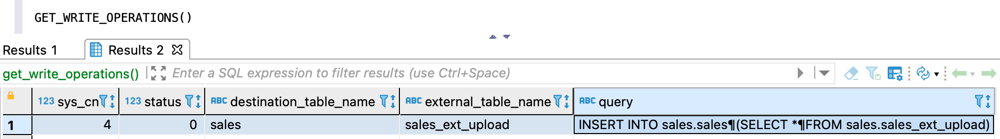

---
layout: default
title: GET_WRITE_OPERATIONS
nav_order: 28
parent: Запросы SQL+
grand_parent: Справочная информация
has_children: false
has_toc: false
---

# GET_WRITE_OPERATIONS

Запрос позволяет получить информацию об 
[операциях записи](../../../overview/main_concepts/write_operation/write_operation.md) горячей 
[дельты](../../../overview/main_concepts/delta/delta.md), находящихся в статусах «Выполняется» и «Ошибка». 
Перед выполнением запроса необходимо определить логическую базу данных, 
[используемую по умолчанию](../../../working_with_system/other_features/default_db_set-up/default_db_set-up.md), 
если она еще не определена.

По каждой операции доступна следующая информация:
* `sys_cn` — номер операции записи;
* `status` — статус операции записи. Возможные значения: 0 — выполняется, 2 — ошибка (операция отменяется);
* `destination_table_name` — имя 
  [логической таблицы](../../../overview/main_concepts/logical_table/logical_table.md)-приемника данных;
* `external_table_name` — имя [внешней таблицы](../../../overview/main_concepts/external_table/external_table.md) 
  загрузки, которая была задействована в операции записи. Значение отсутствует, если внешняя таблица не была 
  задействована в операции (например, операция была запущена функцией 
  [обновления данных](../../../working_with_system/data_update/data_update.md));
* `query` — исходный запрос операции записи.

Успешный ответ содержит объект ResultSet, где каждая строка соответствует одной операции, неуспешный ответ содержит 
исключение.

## Синтаксис {#syntax}

```sql
GET_WRITE_OPERATIONS()
```

На рисунке ниже показан пример ответа с одной операцией в статусе «Выполняется». 
Операция запущена запросом [INSERT INTO logical_table](../INSERT_INTO_logical_table/INSERT_INTO_logical_table.md), который 
загружает данные в логическую таблицу `sales` с использованием внешней таблицы загрузки `sales_ext_upload`.


{: .figure-center}
*Пример ответа на запрос GET_WRITE_OPERATIONS*
{: .figure-caption-center}