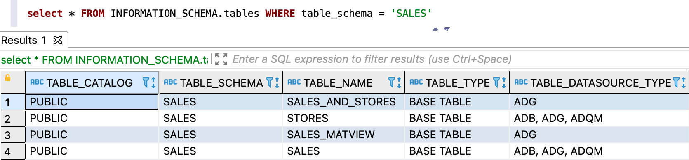

---
layout: default
title: Проверка месторасположения логической сущности
nav_order: 3
parent: Другие действия
grand_parent: Работа с системой
has_children: false
has_toc: false
---

# Проверка месторасположения логической сущности {#datasource_check}

Чтобы проверить, в каких [СУБД](../../../introduction/supported_DBMS/supported_DBMS.md)
[хранилища](../../../overview/main_concepts/data_storage/data_storage.md) размещаются данные 
[логической таблицы](../../../overview/main_concepts/logical_table/logical_table.md) или 
[материализованного представления](../../../overview/main_concepts/materialized_view/materialized_view.md), 
выполните запрос (вместо `DB_NAME` и `ENTITY_NAME` подставьте имя логической базы данных и имя
таблицы или представления в верхнем регистре):
```sql
SELECT * FROM INFORMATION_SCHEMA.tables
WHERE table_schema = '<DB_NAME>' AND (table_name = '<ENTITY_NAME>' AND table_type = 'BASE TABLE')
```

Столбец `table_datasource_type` в результах ответа содержит список СУБД, в которых 
размещаются данные соответствующей логической сущности — логической таблицы
или материализованного представления. Для логических представлений столбец остается пустым.

На рисунке ниже показан пример ответа по всем логическим сущностям логической БД `sales`:

<a id="img_datasource_check"></a>

{: .figure-center}
*Системное представление tables*
{: .figure-caption-center}

Подробнее о других параметрах системного представления `tables` см. в разделе
[Представление tables](../../../reference/system_views/system_views.md#tables).
