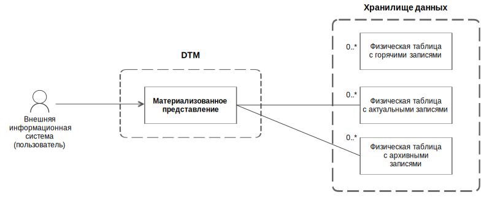
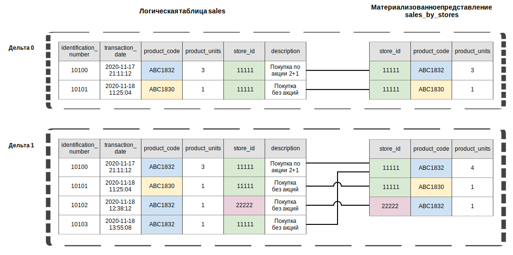

---
layout: default
title: Материализованное представление
nav_order: 6
parent: Основные понятия
grand_parent: Обзор понятий, компонентов и связей
has_children: false
has_toc: false
---

# Материализованное представление

_Материализованное представление_ — структурированная совокупность записей, содержащих результаты выполнения запроса
к одной или нескольким [логическим таблицам](../Логическая_таблица/Логическая_таблица.md). 

Материализованное представление позволяет предварительно вычислить результат запроса и сохранить его для будущего 
использования. Так как результат вычислений обычно имеет небольшой объем по сравнению с исходными данными, 
материализованные представления помогают ускорить работу с большими объемами данных.

Материальное представление строится на основе данных одной [СУБД](../../../Введение/Поддерживаемые_СУБД_хранилища/Поддерживаемые_СУБД_хранилища.md) 
[хранилища](../Хранилище_данных/Хранилище_данных.md) (далее — СУБД-источник), а его данные размещаются в другой СУБД. 
Это позволяет создавать инсталляции, где одна СУБД служит полноценным хранилищем исходных данных, а остальные 
отвечают за быструю выдачу данных по запросам чтения.

В текущей версии системы доступно создание материальных представлений в ADG на основе данных из ADB.

Система поддерживает целостность данных материализованных представлений, периодически синхронизируя их с 
данными СУБД-источника (см. [ниже](#синхронизация-материализованных-представлений)).

Материализованное представление дает доступ к актуальным и архивным состояниях объектов. Чтение горячих 
данных недоступно: это позволяет избежать чтения изменений, не полностью загруженных из СУБД-источника. Данные 
материализованного представления хранятся аналогично данным логических таблиц — в [физических таблицах](../Физическая_таблица/Физическая_таблица.md)
[хранилища](../Хранилище_данных/Хранилище_данных.md), которые система автоматически создает при создании представления 
и далее поддерживает в актуальном виде.


{: .figure-center}
*Связи материализованного представления с логическими и физическими таблицами*
{: .figure-caption-center}

Материализованные представления можно [создавать](../../../Работа_с_системой/Управление_схемой_данных/Создание_материализованного_представления/Создание_материализованного_представления.md)
и [удалять](../../../Работа_с_системой/Управление_схемой_данных/Удаление_материализованного_представления/Удаление_материализованного_представления.md).
Из материализованного представления можно [запрашивать](../../../Работа_с_системой/Запрос_данных/Запрос_данных.md) 
данные — так же, как из логических таблиц и [логических представлений](../Логическое_представление/Логическое_представление.md). 
[Загрузка](../../../Работа_с_системой/Загрузка_данных/Загрузка_данных.md) и [выгрузка](../../../Работа_с_системой/Выгрузка_данных/Выгрузка_данных.md) 
данных материализованных представлений не поддерживается.

При запросе данных из материализованного представления можно указать [момент времени](../../../Справочная_информация/Запросы_SQLplus/SELECT/SELECT.md#sect_for_system_time),
по состоянию на который запрашиваются данные. Если момент времени не указан, система возвращает данные, актуальные
на момент последней синхронизации представления, иначе — данные, актуальные на запрашиваемый момент времени. 

При запросе данных из материализованного представления может оказаться, что оно отстало от СУБД-источника и 
пока не содержит запрошенные данные. В этом случае система перенаправляет запрос к исходным таблицам СУБД-источника
(см. раздел [Маршрутизация запросов к данным материализованных представлений](../../../Работа_с_системой/Запрос_данных/Маршрутизация_запросов_к_данным/Маршрутизация_запросов_к_данным.md#маршрутизация-запросов-к-данным-материализованных-представлений)).
С точки зрения внешней системы, перенаправленный запрос может выполняться дольше, но в остальном выглядит так же, как
если бы запрос не был перенаправлен — возвращается срез данных, аналогичный срезу, который хранится в представлении,
но в наиболее актуальном виде.

## Синхронизация материализованных представлений

Все материализованные представления [окружения](../Окружение/Окружение.md) синхронизируются с периодичностью, 
заданной в [конфигурации](../../../Эксплуатация/Конфигурация/Конфигурация.md) 
системы (см. параметр `MATERIALIZED_VIEWS_SYNC_PERIOD_MS`). По умолчанию синхронизация запускается раз в 5 секунд.
Синхронизация запускается только по таймеру и не запускается по другим событиям, таким как создание материального 
представления или загрузка данных в СУБД-источник.

При запуске синхронизации система проверяет, появились ли в СУБД-источнике закрытые дельты с момента последней
синхронизации и, если они появились, система обновляет данные материализованных представлений новыми данными.

Изменения переносятся по одной дельте, с полным сохранением изменений, выполненных в этих дельтах. По
каждой дельте рассчитывается и сохраняется результат запроса, указанного при создании представление. Таким образом, 
в материальном представлении сохраняется такой же уровень историчности данных, как и в исходных логических таблицах, 
на которых построено представление.

Если системе не удалось синхронизировать какое-либо материализованное представление, она делает несколько 
повторных попыток. Максимальное количество попыток синхронизации представления задается в конфигурации (см. параметр `MATERIALIZED_VIEWS_RETRY_COUNT`), 
по умолчанию система делает до 10 попыток. Если количество попыток исчерпано, но 
материализованное представление так и не удалось синхронизировать, система прекращает попытки синхронизировать это 
представление (до перезапуска). После перезапуска системы счетчики попыток по всем представлениям обнуляются, и, если 
какие-то представления остались несинхронизированными, система возобновляет попытки их синхронизировать.

### Пример синхронизации материализованного представления

Рассмотрим пример материализованного представления `sales_by_stores`, которое содержит результат агрегации и группировки 
данных логической таблицы `sales`:
```sql
CREATE MATERIALIZED VIEW sales.sales_by_stores (
store_id INT NOT NULL,
product_code VARCHAR(256) NOT NULL,
product_units INT NOT NULL,
PRIMARY KEY (store_id, product_code)
)
DISTRIBUTED BY (store_id)
DATASOURCE_TYPE (adg)
AS SELECT store_id, product_code, SUM(product_units) as product_units FROM sales.sales
   WHERE product_code <> 'ABC0001'
   GROUP BY store_id, product_code
DATASOURCE_TYPE = 'adb'
```

Предположим, что в логической базе данных, содержащей таблицу `sales` и материализованное представление `sales_by_stores`, 
присутствует две дельты. В дельте 0 в таблицу `sales` было загружено две записи, в дельте 1 — еще две записи с другими 
первичными ключами (новые записи). 
Таким образом, таблица `sales` содержит две записи в дельте 0 и четыре записи в дельте 1.

При синхронизации материального представления в нем сохраняются результаты запроса к таблице `sales`. 
Результат рассчитывается и сохраняется по каждой дельте в отдельности (см. рисунок ниже). При этом неважно, 
когда было создано представление: до дельты 0, после дельты 1 или в какой-то момент между этими дельтами. 

На рисунке ниже показан пример синхронизации материализованного представления: по каждой дельте
рассчитывается и сохраняется сумма по столбцу `product_units` таблицы `sales` с группировкой по столбцам `store_id` и `product_code`. 

{: .figure-center}
*Пример синхронизации материализованного представления*
{: .figure-caption-center}