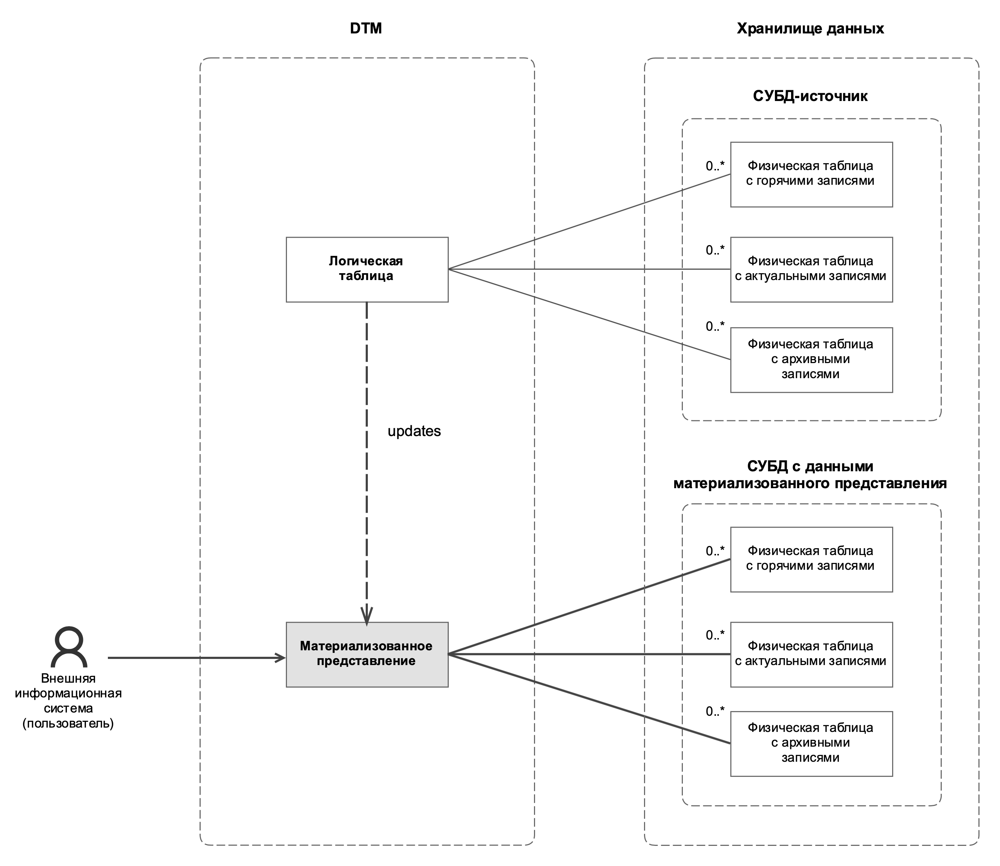

---
layout: default
title: Материализованное представление
nav_order: 6
parent: Основные понятия
grand_parent: Обзор понятий, компонентов и связей
has_children: false
has_toc: false
---

# Материализованное представление

_Материализованное представление_ — структурированная совокупность записей, содержащих результаты выполнения запроса
к указанным [логическим таблицам](../Логическая_таблица/Логическая_таблица.md). 

Материализованное представление позволяет предварительно вычислить результат запроса и сохранить его для будущих 
использований. Так как результат вычислений обычно имеет небольшой объем по сравнению с исходными данными, 
материализованные представления помогают ускорить работу с большими объемами данных.

Материальное представление строится на основе данных одной [СУБД](../../../Введение/Поддерживаемые_СУБД_хранилища/Поддерживаемые_СУБД_хранилища.md) 
[хранилища](../Хранилище_данных/Хранилище_данных.md) (далее — СУБД-источник), а его данные размещаются в другой СУБД. 
Это позволяет создавать инсталляции, где одна СУБД служит полноценным хранилищем исходных данных, а остальные 
отвечают за быструю выдачу данных по запросам чтения.

В текущей версии системы доступно создание материальных представлений в ADG на основе данных из ADB.

Система поддерживает целостность данных материализованных представлений, периодически синхронизируя их с 
данными СУБД-источника (см. раздел [Синхронизация материализованных представлений](#синхронизация-материализованных-представлений)).

Материализованное представление предоставляет доступ к актуальным и архивным состояниях объектов. Чтение горячих 
данных недоступно: это позволяет избежать чтения изменений, которые частично загружены из СУБД-источника. Данные 
материализованного представления хранятся аналогично данным логических таблиц — в [физических таблицах](../Физическая_таблица/Физическая_таблица.md)
[хранилища](../Хранилище_данных/Хранилище_данных.md), которые система автоматически создает при создании представления 
и далее поддерживает.

{: .figure-center}
*Связи материализованного представления с логическими и физическими таблицами*
{: .figure-caption-center}

Материализованные представления можно [создавать](../../../Работа_с_системой/Управление_схемой_данных/Создание_материализованного_представления/Создание_материализованного_представления.md)
и [удалять](../../../Работа_с_системой/Управление_схемой_данных/Удаление_материализованного_представления/Удаление_материализованного_представления.md).
Данные материализованного представления можно [запрашивать](../../../Работа_с_системой/Запрос_данных/Запрос_данных.md) 
— аналогично запросам из логических таблиц и представлений. Однако, в отличие от логических таблиц и представлений, 
[загрузка](./../../Работа_с_системой/Загрузка_данных/Загрузка_данных.md) и [выгрузка](../../../Работа_с_системой/Выгрузка_данных/Выгрузка_данных.md) 
данных материализованных представлений не поддерживается.

При запросе данных из материализованного представления можно указать [момент времени](../../../Справочная_информация/Запросы_SQLplus/SELECT/SELECT.md#sect_for_system_time),
по состоянию на который запрашиваются данные. Если момент времени не указан, система возвращает данные, актуальные
на момент последней синхронизации представления, иначе — данные, актуальные на запрашиваемый момент времени. 

Система автоматически перенаправляет запросы данных, направленные к материализованному представлению, 
к исходным таблицам СУБД-источника, если представление еще не синхронизировалось и данные за запрашиваемый момент 
времени отсутствуют в представлении (см. раздел [Маршрутизация запросов к данным материализованных представлений](../../../Работа_с_системой/Запрос_данных/Маршрутизация_запросов_к_данным/Маршрутизация_запросов_к_данным.md#маршрутизация-запросов-к-данным-материализованных-представлений)). 
С точки зрения внешней системы, перенаправленный запрос может выполняться дольше, но в остальном выглядит так же, как 
если бы запрос не был перенаправлен — возвращается срез данных, аналогичный срезу, который хранится в представлении, 
но в гарантированно актуальном виде.

## Синхронизация материализованных представлений

Все материализованные представления окружения синхронизируются с периодичностью, заданной в [конфигурации](../../../Эксплуатация/Конфигурация/Конфигурация.md) 
системы (см. параметр `MATERIALIZED_VIEWS_SYNC_PERIOD_MS`). По умолчанию синхронизация запускается раз в 5 секунд.
Синхронизация не запускается по каким-либо событиям: при загрузке данных или закрытии дельты в СУБД-источнике или 
при создании материального представления.

При запуске синхронизации система проверяет, появились ли в СУБД-источнике закрытые дельты с момента последней
синхронизации и, если они появились, система обновляет данные материализованных представлениями новыми данными.

Изменения переносятся по одной дельте, с полным сохранением изменений, выполненных в этих дельтах. По
каждой дельте рассчитывается и сохраняется результат запроса, заданного для представления. Таким образом, 
в материальном представлении сохраняется такой же уровень историчности данных, как и в исходных логических таблицах, 
на которых построено представление.

Если данные какого-либо материализованного представления не удалось синхронизировать, система повторяет попытки 
его синхронизировать. Количество попыток синхронизации задается в конфигурации (см. параметр `MATERIALIZED_VIEWS_RETRY_COUNT`), 
по умолчанию система делает 10 попыток по каждому представлению. Если количество попыток исчерпано, но 
материализованное представление так и не удалось синхронизировать, система прекращает попытки синхронизировать это 
представление (до перезапуска системы).