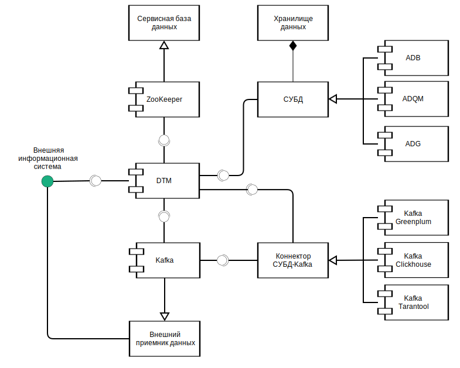

---
layout: default
title: Связи с другими системами и компонентами
nav_order: 3
parent: Обзор понятий, компонентов и связей
has_children: true
has_toc: false
---

# Связи с другими системами и компонентами

Система взаимодействует со следующими внешними системами и компонентами (см. рисунок [ниже](#img_interactions)):
*   внешней информационной системой-клиентом (по JDBC-интерфейсу),
*   [сервисной базой данных](../Основные_понятия/Сервисная_база_данных/Сервисная_база_данных.md) 
    (по API ZooKeeper),
*   [СУБД](../../Введение/Поддерживаемые_СУБД_хранилища/Поддерживаемые_СУБД_хранилища.md) 
    [хранилища](../Основные_понятия/Хранилище_данных/Хранилище_данных.md) данных (по интерфейсу JDBC или 
    REST API — в зависимости от типа СУБД),
*   коннекторами (по API коннекторов);
*   брокером сообщений Kafka (по API Kafka).

На рисунке ниже показаны взаимодействия системы с внешними системами и компонентами.

{:height="70%" width="70%"}
{: .figure-center}
*Внешние взаимодействия системы*
{: .figure-caption-center}

Взаимодействия системы с внешними системами и компонентами при выполнении основных действий описаны 
в разделах:
*   [Порядок обработки запросов на обновление логической схемы](Порядок_обработки_запросов_на_обновление_логической_схемы/Порядок_обработки_запросов_на_обновление_логической_схемы.md)
*   [Порядок обработки запросов на загрузку данных](Порядок_обработки_запросов_на_загрузку_данных/Порядок_обработки_запросов_на_загрузку_данных.md)
*   [Порядок обработки запросов на выгрузку данных](Порядок_обработки_запросов_на_выгрузку_данных/Порядок_обработки_запросов_на_выгрузку_данных.md)
*   [Порядок обработки запросов на чтение данных](Порядок_обработки_запросов_на_чтение_данных/Порядок_обработки_запросов_на_чтение_данных.md)