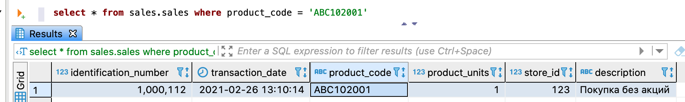

---
layout: default
title: Запрос данных
nav_order: 5
parent: Работа с системой
has_children: true
has_toc: false
---

# Запрос данных

Система позволяет запрашивать небольшие объемы актуальных и архивных данных, а также изменений, 
выполненных в рамках указанных дельт. Возможные способы выборки данных описаны в секции 
[FOR SYSTEM_TIME](../../Справочная_информация/Запросы_SQLplus/SELECT/SELECT.md#sect_for_system_time) раздела [SELECT](../../Справочная_информация/Запросы_SQLplus/SELECT/SELECT.md).

Чтобы запросить небольшой объем данных из [логических таблиц](../../Обзор_понятий_компонентов_и_связей/Основные_понятия/Логическая_таблица/Логическая_таблица.md) 
и (или) [представлений](../../Обзор_понятий_компонентов_и_связей/Основные_понятия/Логическое_представление/Логическое_представление.md), 
выполните запрос [SELECT](../../Справочная_информация/Запросы_SQLplus/SELECT/SELECT.md). Запросы на чтение 
данных обрабатываются в порядке, описанном в разделе 
[Порядок обработки запросов на чтение данных](../../Обзор_понятий_компонентов_и_связей/Связи_с_другими_системами_и_компонентами/Порядок_обработки_запросов_на_чтение_данных/Порядок_обработки_запросов_на_чтение_данных.md). 
При успешном выполнении запроса запрошенные данные возвращаются в ответе.

**Примечание:** под небольшим объемом данных подразумевается результат, содержащий десятки строк. 
Для запроса большого объема данных следует использовать функцию [выгрузки данных](../Выгрузка_данных/Выгрузка_данных.md).

На рисунке ниже показан пример запроса из логической таблицы `sales`, возвращающий одну строку. 
Так как секция `DATASOURCE_TYPE` не указана, система автоматически направляет запрос в СУБД, оптимальную 
для его исполнения (см. [Маршрутизация запросов к данным](Маршрутизация_запросов_к_данным/Маршрутизация_запросов_к_данным.md)).


{: .figure-center}
*Запрос небольшого объема данных*
{: .figure-caption-center}

## Пример

```sql
-- выбор логической базы данных sales в качестве базы данных по умолчанию
USE sales

-- запрос данных из логической таблицы sales
SELECT s.store_id, SUM(s.product_units) AS product_amount
FROM sales AS s
GROUP BY (s.store_id)
ORDER BY product_amount DESC
LIMIT 20

-- запрос данных из логического представления stores_by_sold_products
SELECT sold.store_id, sold.product_amount
FROM stores_by_sold_products AS sold
```