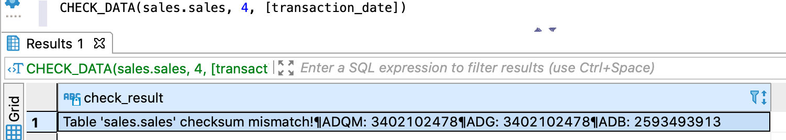
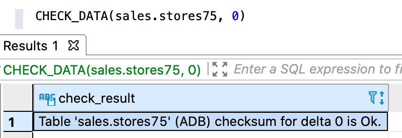

---
layout: default
title: CHECK_DATA
nav_order: 3
parent: Запросы SQL+
grand_parent: Справочная информация
has_children: false
has_toc: false
---

# CHECK_DATA

Запрос позволяет проверить идентичность данных [логической таблицы](../../../Обзор_понятий_компонентов_и_связей/Основные_понятия/Логическая_таблица/Логическая_таблица.md), 
загруженных в различные [СУБД](../../../Введение/Поддерживаемые_СУБД_хранилища/Поддерживаемые_СУБД_хранилища.md) 
[хранилища](../../../Обзор_понятий_компонентов_и_связей/Основные_понятия/Хранилище_данных/Хранилище_данных.md) 
в указанный период. Проверяются все [операции записи](../../../Обзор_понятий_компонентов_и_связей/Основные_понятия/Операция_записи/Операция_записи.md), 
начиная с [дельты](../../../Обзор_понятий_компонентов_и_связей/Основные_понятия/Дельта/Дельта.md), 
указанной в запросе, и заканчивая последней закрытой дельтой. Обе граничные дельты включаются в проверку.

Алгоритм проверки зависит от параметров запроса:
*   если столбцы указаны, по каждой операции записи в каждой из целевых СУБД рассчитывается 
    контрольная сумма на основе значений указанных столбцов и полученные суммы сравниваются между СУБД;
*   если столбцы не указаны, по каждой операции записи в каждой из целевых СУБД рассчитывается количество
    записей и полученные значения сравниваются между СУБД.
    
**Примечание:** в проверке участвуют целевые СУБД хранилища — те СУБД, в которых размещены данные 
проверяемой логической таблицы. Если такая СУБД одна, проверка все равно проходит и считается успешной 
(см. рисунок [ниже](#img_check_for_one_db)).

В ответе возвращается:
*   объект ResultSet с одной записью, содержащей результаты проверки, при успешном выполнении запроса;
*   исключение при неуспешном выполнении запроса.

Если запрос выполнен успешно, ответ содержит сообщение об успешной проверке или найденных расхождениях, 
а также список проверенных СУБД хранилища.

На рисунке ниже показан пример ответа при наличии расхождения: контрольная сумма в ADB отличается от 
контрольной суммы в ADG и ADQM. Различия вызваны тем, что запись была удалена напрямую из ADB 
(за рамками системы), а записи в ADG и ADQM остались без изменений.


{: .figure-center}
*Ответ CHECK_DATA с найденными расхождениями*
{: .figure-caption-center}

На рисунке ниже показан пример ответа при успешной проверке логической таблицы, данные которой 
размещены только в ADB.

<a id="img_check_for_one_db"></a>
{:height="50%" width="50%"}
{: .figure-center}
*Ответ CHECK_DATA с проверкой только в ADB*
{: .figure-caption-center}

## Синтаксис

```sql
CHECK_DATA([db_name.]table_name, delta_number[, square-bracketed_column_list])
```

## Параметры

*   `db_name` — имя логической базы данных, в которой находится проверяемая логическая таблица. Параметр 
    опционален, если выбрана логическая БД, [используемая по умолчанию](../../../Работа_с_системой/Другие_функции/Определение_логической_БД_по_умолчанию/Определение_логической_БД_по_умолчанию.md);
*   `table_name` — имя проверяемой логической таблицы;
*   `delta_number` — номер дельты, с которой начинается проверка. Должен быть меньше или равен номеру 
    последней закрытой дельты. Номер последней закрытой дельты можно узнать с помощью запроса 
    [GET_DELTA_OK](../../../Справочная_информация/Запросы_SQLplus/GET_DELTA_OK/GET_DELTA_OK.md);
*   `square_bracketed_column_list` — список проверяемых столбцов таблицы. Элементы списка должны быть 
    указаны в квадратных скобках через запятую, например `[identification_number, transaction_date]`. 
    Если столбцы указаны, проверяется контрольная сумма записей по каждой операции записи во всех целевых 
    СУБД хранилища, иначе — количество таких записей.
    
## Ограничения

Возможен ложноположительный результат проверки.

## Примеры

Проверка целостности данных логической таблицы `sales` в диапазоне \[дельта 4, последняя закрытая дельта\]:
```sql
CHECK_DATA(sales.sales, 4)
```

Проверка целостности данных столбцов `identification_number` и `transaction_date` логической таблицы 
`sales`:
```sql
CHECK_DATA(sales.sales, 4, [identification_number, transaction_date])
CHECK_DATA(sales.sales, 4)
```