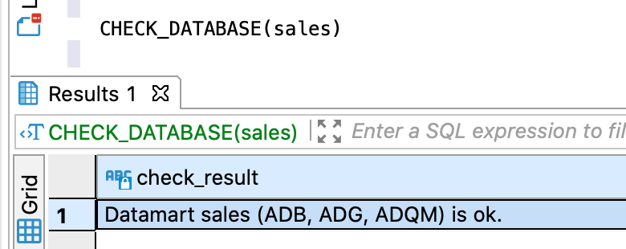
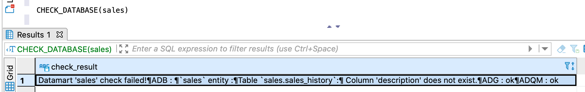

---
layout: default
title: CHECK_DATABASE
nav_order: 4
parent: Запросы SQL+
grand_parent: Справочная информация
has_children: false
has_toc: false
---

# CHECK_DATABASE

Запрос позволяет проверить соответствие [логических таблиц](../../../Обзор_понятий_компонентов_и_связей/Основные_понятия/Логическая_таблица/Логическая_таблица.md) 
[логической базы данных](../../../Обзор_понятий_компонентов_и_связей/Основные_понятия/Логическая_база_данных/Логическая_база_данных.md) 
и их физических представлений — [физических таблиц](../../../Обзор_понятий_компонентов_и_связей/Основные_понятия/Физическая_таблица/Физическая_таблица.md) 
в [хранилище данных](../../../Обзор_понятий_компонентов_и_связей/Основные_понятия/Хранилище_данных/Хранилище_данных.md).

В проверке участвуют логические таблицы логической базы данных и все связанные с ними физические таблицы. 
Если СУБД хранилища не хранит данные логической таблицы, и, следовательно, не содержит связанные 
физические таблицы, она пропускается при проверке логической таблицы.

Проверяется соответствие следующих элементов:
*   имен и порядка следования столбцов,
*   типов данных столбцов,
*   первичного ключа.

Имена и порядок следования проверяются для всех столбцов логических и физических таблиц, включая 
служебные столбцы, имеющиеся только у физических таблиц. Например, если служебный столбец `sys_to` 
удален из физической таблицы, в ответе вернется сообщение о расхождении.

В ответе возвращается:
*   объект ResultSet с одной записью, содержащей результаты проверки, при успешном выполнении запроса;
*   исключение при неуспешном выполнении запроса.

Возвращаемая информация включает сообщение об успешной проверке или найденных расхождениях, а также 
список проверенных СУБД хранилища.

На рисунках ниже показаны примеры ответов: на первом — ответ при отсутствии расхождений, на втором — 
при наличии расхождений. Расхождения вызваны тем, что в целях иллюстрации между первым и вторым запросом 
столбец `description` был переименован в ADB.

{:height="50%" width="50%"}
{: .figure-center}
*Ответ CHECK_DATABASE при успешной проверке*
{: .figure-caption-center}


{: .figure-center}
*Ответ CHECK_DATABASE с найденными расхождениями*
{: .figure-caption-center}

## Синтаксис

Проверка логической базы данных, [выбранной по умолчанию](../../../Работа_с_системой/Другие_функции/Определение_логической_БД_по_умолчанию/Определение_логической_БД_по_умолчанию.md):
```sql
CHECK_DATABASE()
```

Проверка указанной логической базы данных:
```sql
CHECK_DATABASE(db_name)
```

## Параметры

*   `db_name` — имя логической базы данных, для таблиц которой выполняется проверка.

## Пример

```sql
CHECK_DATABASE(sales)
```