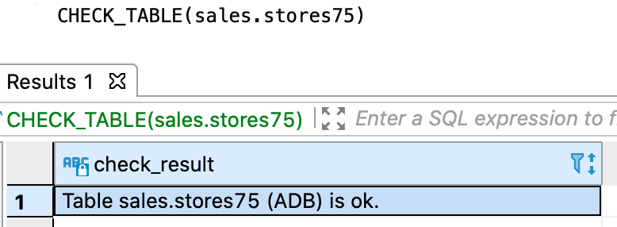
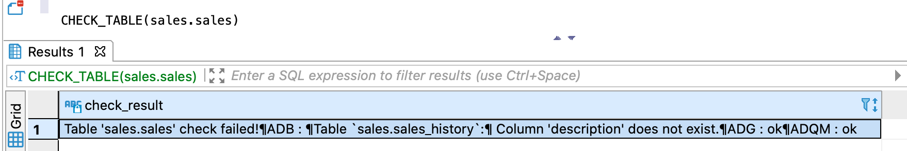

---
layout: default
title: CHECK_TABLE
nav_order: 6
parent: Запросы SQL+
grand_parent: Справочная информация
has_children: false
has_toc: false
---

# CHECK_TABLE

Запрос позволяет проверить соответствие [логической таблицы](../../../Обзор_понятий_компонентов_и_связей/Основные_понятия/Логическая_таблица/Логическая_таблица.md) 
и ее физических представлений — [физических таблиц](../../../Обзор_понятий_компонентов_и_связей/Основные_понятия/Физическая_таблица/Физическая_таблица.md) 
в [хранилище данных](../../../Обзор_понятий_компонентов_и_связей/Основные_понятия/Хранилище_данных/Хранилище_данных.md).

В проверке участвуют указанная логическая таблица и все связанные с ней физические таблицы. Если СУБД 
хранилища не хранит данные логической таблицы, и, следовательно, не содержит связанные физические таблицы, 
она пропускается при проверке.

Проверяется соответствие следующих элементов:
*   имен и порядка следования столбцов,
*   типов данных столбцов,
*   первичного ключа.

Имена и порядок следования проверяются для всех столбцов логической и физических таблиц, включая служебные 
столбцы, имеющиеся только у физических таблиц. Например, если служебный столбец `sys_to` удален из 
физической таблицы, в ответе вернется сообщение о расхождении.

В ответе возвращается:
*   объект ResultSet с одной записью, содержащей результаты проверки, при успешном выполнении запроса;
*   исключение при неуспешном выполнении запроса.

Возвращаемая информация включает сообщение об успешной проверке или найденных расхождениях, а также список 
проверенных СУБД хранилища.  
На рисунках ниже показаны примеры ответа в случае успешной проверки. В первом примере проверка выполнена 
для логической таблицы, данные которой размещены во всех СУБД хранилища, во втором — для таблицы, данные 
которой размещены только в ADB.

{:height="50%" width="50%"}
{: .figure-center}
*Ответ CHECK_TABLE при успешной проверке*
{: .figure-caption-center}

{:height="50%" width="50%"}
{: .figure-center}
*Ответ CHECK_TABLE с проверкой только в ADB*
{: .figure-caption-center}

На рисунке ниже показан пример ответа при наличии расхождений. Проверка прошла успешно для ADG и ADQM, 
а в ADB найдено несоответствие — столбец `description` отсутсвует в физической таблице с архивными записями.


{: .figure-center}
*Ответ CHECK_TABLE с найденными расхождениями*
{: .figure-caption-center}

## Синтаксис

```sql
CHECK_TABLE([db_name.]table_name)
```

## Параметры

*   `db_name` — имя логической базы данных, которой принадлежит проверяемая логическая таблица. 
    Указывается опционально, если выбрана логическая БД, [используемая по умолчанию](../../../Работа_с_системой/Другие_функции/Определение_логической_БД_по_умолчанию/Определение_логической_БД_по_умолчанию.md);
*   `table_name` — имя проверяемой логической таблицы.

## Пример

```sql
CHECK_TABLE(sales.stores)
```