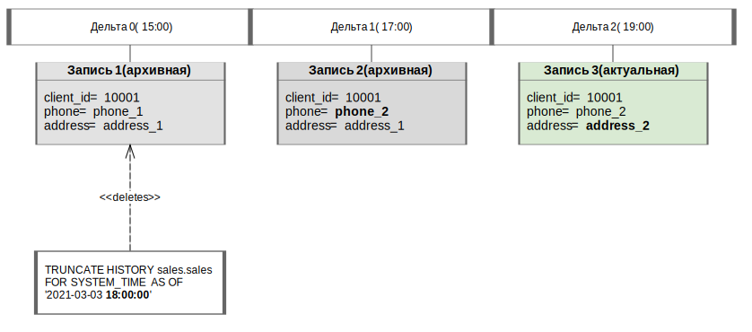

---
layout: default
title: TRUNCATE HISTORY
nav_order: 29
parent: Запросы SQL+
grand_parent: Справочная информация
has_children: false
has_toc: false
---

# TRUNCATE HISTORY

Запрос позволяет удалить записи [логической таблицы](../../../Обзор_понятий_компонентов_и_связей/Основные_понятия/Логическая_таблица/Логическая_таблица.md) 
согласно заданным условиям. В зависимости от параметров запроса удаляются записи одной из категорий:

*   записи таблицы, которые были перенесены в архив до указанного момента времени (включительно) и 
    соответствуют условию, заданному в запросе;

*   все архивные и актуальные записи таблицы, которые соответствуют условию, заданному в запросе.


Если в запросе указан момент времени, система определяет [дельту](../../../Обзор_понятий_компонентов_и_связей/Основные_понятия/Дельта/Дельта.md), 
которая являлась последней закрытой дельтой на тот момент, и удаляет все записи логической таблицы, 
которые стали архивными в эту дельту или ранее и соответствуют заданному условию. Иначе, если задано 
ключевое слово `infinite`, удаляются все записи таблицы, соответствующие условию.

В ответе возвращается:

*   пустой объект ResultSet при успешном выполнении запроса;

*   исключение при неуспешном выполнении запроса.

В результате успешного выполнения запроса записи, удовлетворяющие его параметрам, удаляются из логической 
таблицы.

**Внимание:** удаленные данные не подлежат восстановлению средствами системы.

На рисунке ниже показан пример работы запроса с указанным моментом времени. В примере логическая таблица 
содержит три записи об одном клиенте, загруженные в рамках трех разных дельт (дельта 0, дельта 1, дельта 2) 
в течение одного дня (2021-03-03). В результате исполнения запроса удаляется `запись 0`: на момент 
времени 18:00:00 `дельта 1` была последней закрытой дельтой, и только `запись 0` была архивной в эту 
дельту (`запись 1` была актуальной).


{: .figure-center}
*Удаление архивной записи по запросу с меткой времени*
{: .figure-caption-center}

## Синтаксис

```sql
TRUNCATE HISTORY [db_name.]table_name FOR SYSTEM_TIME AS OF date_time_expression
[WHERE filter_expression]
```
## Параметры

*   `db_name` — имя логической базы данных. Указывается опционально, если выбрана логическая БД, 
    [используемая по умолчанию](../../../Работа_с_системой/Другие_функции/Определение_логической_БД_по_умолчанию/Определение_логической_БД_по_умолчанию.md);

*   `table_name` — имя логической таблицы, из которой удаляются записи;

*   `date_time_expression` — выражение, определяющее категорию удаляемых записей. Может принимать 
    следующие значения:

    *   `'YYYY-MM-DD HH:MM:SS'` — удаление архивных записей по указанный момент времени;

    *   `'infinite'` — удаление всех актуальных и архивных записей;

*   `filter_expression` — условие выбора записей, подлежащих удалению.


## Пример

Удаление архивных записей таблицы `sales`, в которых значение столбца `product_units` меньше `10`, 
по момент времени `'2019-12-23 15:15:14'`:
```sql
TRUNCATE HISTORY sales.sales FOR SYSTEM_TIME AS OF '2019-12-23 15:15:14'
WHERE product_units < 10
```
Удаление всех актуальных и архивных записей таблицы `stores`, в которых значение столбца 
`identification_number` равно `123456`:
```sql
TRUNCATE HISTORY sales.stores FOR SYSTEM_TIME AS OF 'infinite'
WHERE identification_number = 123456
```