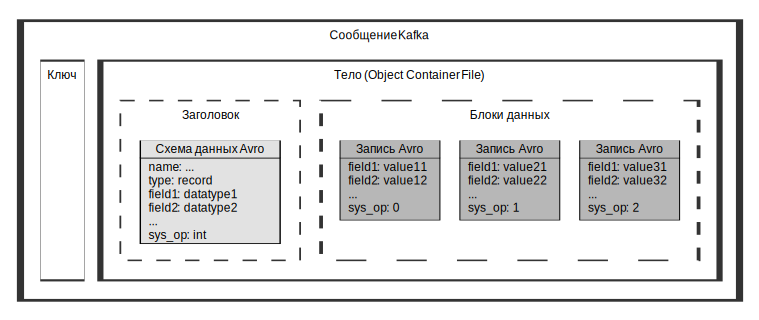

---
layout: default
title: Формат загрузки данных
nav_order: 4
parent: Справочная информация
has_children: false
has_toc: false
---

# Формат загрузки данных

Данные загружаются в систему в виде сообщений топиков Kafka. Сообщения имеют структуру, показанную 
на рисунке ниже.


{: .figure-center}
*Структура загружаемых сообщений*
{: .figure-caption-center}

Для успешной загрузки данные должны соответствовать следующим условиям:
*   Данные представлены в виде сообщений топика Kafka.
*   Каждое сообщение состоит из ключа и тела. Требования к ключу сообщения не предъявляются.
*   Тело сообщения представляет собой Avro-файл ([Object Container File](https://avro.apache.org/docs/1.10.2/spec.html#Object+Container+Files)) и состоит
    из заголовка и блоков данных.
*   Заголовок Avro-файла содержит Avro-схему данных.
*   Схема данных содержит следующие элементы: имя, тип “record” и перечень полей. 
    Для каждого поля указано имя, а также тип данных из числа перечисленных в разделе 
    [Загружаемые типы данных](../Поддерживаемые_типы_данных/Загружаемые_типы_данных/Загружаемые_типы_данных.md) 
    (см. пример [ниже](#пример-загружаемой-схемы-данных-avro)). Последним полем схемы указано служебное поле `sys_op` с типом данных int.
*   Блоки данных содержат набор записей, представленных в бинарной кодировке или в формате JSON. Записи соответствуют схеме данных из заголовка Avro-файла.
*   В наборе записей для каждой записи указан перечень полей и их значений. Последним полем 
    каждой записи указано служебное поле `sys_op` со значением 0 (если запись добавляется или обновляется) 
    или 1 (если запись удаляется). Имена и порядок перечисления полей, а также типы данных их значений 
    соответствуют схеме данных (см. пример [ниже](#пример-загружаемых-записей-avro)).
*   Состав и порядок полей совпадают во всех следующих объектах:
    *   в схеме данных заголовка Avro-файла,
    *   в наборе загружаемых записей,
    *   во внешней таблице загрузки (поле `sys_op` может отсутствовать, так как при создании внешней 
        таблицы его можно не указывать),
    *   в логической таблице, в которую загружаются данные (поле `sys_op` **должно** отсутствовать, 
        так как оно относится к числу зарезервированных служебных полей).
        
В схеме данных можно использовать логические типы Avro, а также элементы unions 
(см. пример [ниже](#пример-загружаемой-схемы-данных-avro)). Типы данных Avro, доступные к загрузке в систему, описаны в разделе 
[Загружаемые типы данных](../Поддерживаемые_типы_данных/Загружаемые_типы_данных/Загружаемые_типы_данных.md).

Подробнее о формате Avro см. в официальной документации на сайте [https://avro.apache.org](https://avro.apache.org/).

## Примеры

### Пример загружаемой схемы данных Avro

Пример ниже содержит схему данных Avro, используемую для загрузки данных о продажах в логическую таблицу 
`sales`. Для поля `transaction_date` указан логический тип Avro, для поля `description` — элемент union. 
Для наглядности примера бинарные данные представлены в **JSON-формате**.
```json
{
  "name": "sales",
  "type": "record",
  "fields": [
    {
      "name": "identification_number",
      "type": "long"
    },
    {
      "name": "transaction_date",
      "type": "long",
      "logicalType": "timestamp-micros"
    },
    {
      "name": "product_code",
      "type": "string"
    },
    {
      "name": "product_units",
      "type": "long"
    },
    {
      "name": "store_id",
      "type": "long"
    },
    {
      "name": "description",
      "type": [
        "null",
        "string"
      ]
    },
    {
      "name": "sys_op",
      "type": "int"
    }
  ]
}
```

### Пример загружаемых записей Avro

Пример ниже содержит набор записей о продажах, загружаемых в логическую таблицу `sales`. 
Для наглядности примера бинарные данные представлены в **JSON-формате**.
```json
[
  {
    "identification_number": 1000111,
    "transaction_date": 1614269474000000,
    "product_code": "ABC102101",
    "product_units": 2,
    "store_id": 1000012345,
    "description": "Покупка по акции 1+1",
    "sys_op": 0
  },
  {
    "identification_number": 1000112,
    "transaction_date": 1614334214000000,
    "product_code": "ABC102001",
    "product_units": 1,
    "store_id": 1000000123,
    "description": "Покупка без акций",
    "sys_op": 0
  },
  {
    "identification_number": 1000020,
    "transaction_date": 1614636614000000,
    "product_code": "ABC102010",
    "product_units": 4,
    "store_id": 1000000123,
    "description": "Покупка по акции 1+1",
    "sys_op": 1
  }
]
```